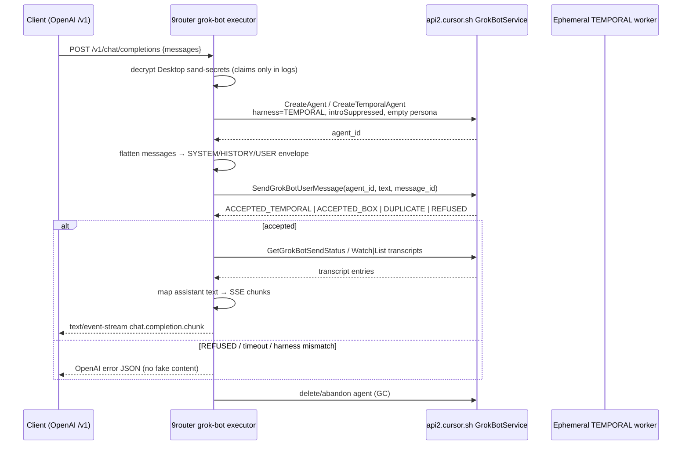

# Plan: Ephemeral Grok Bot × 9router `/v1` harness

**Date:** 2026-09-21 (PT)  
**Updated:** 2026-09-21 ~4:56 PM PT  
**Parent plan:** [`2026-09-21-grok-bot-desktop-integration.md`](./2026-09-21-grok-bot-desktop-integration.md) (harness-first; cross-linked)  
**Repo:** `/Users/admin/Projects/opensource/9router`  
**Worktree:** `/Users/admin/.grok/worktrees/opensource-9router/9router-grok-bot-ephemeral`  
**Branch:** `feat/grok-bot-ephemeral-harness` (from `feat/grok-bot-desktop-discover` or `dev`)  
**Remotes:** origin `decolua/9router`, fork `tommyyzhao/9router` — **DO NOT push** without ask  
**:20128:** **DO NOT restart**

---

## 1. Goal

Expose OpenAI-compatible `POST /v1/chat/completions` through 9router by driving **ephemeral TEMPORAL (or minimal) Grok Bot workers** via Desktop sand-secrets session JWT:

1. Create a short-lived agent (`harness: TEMPORAL`, intro suppressed, empty persona).
2. Flatten the full OpenAI `messages` array into one enveloped Send text (stateless).
3. `SendGrokBotUserMessage` into **that** agent id (never SFC / personal BOX / Desktop default/main).
4. Watch/List transcripts → map assistant text → OpenAI SSE chunks.
5. GC / abandon the ephemeral agent.

**Context model (LT-approved):**

| Rule | Choice |
|---|---|
| Routing | Never through SFC/personal BOX or Desktop default/main agent |
| Default lifecycle | **Ephemeral** fresh worker per request (or short-lived) |
| Messages | Full OpenAI `messages` flatten — **stateless** |
| Harness | Prefer `TEMPORAL` + `introductionSuppressed: true` + `kickstartRequested: false` |
| Persona | Empty / name pattern `9router-worker-*`; no skills / plugins / MCP / memory |
| Envelope | SYSTEM / HISTORY / USER sections in Send `text` so request body owns instructions |
| Sand tax | Residual Sand platform harness accepted |
| Inference mint | Optional later — **not** on critical path |
| Sticky session | Later opt-in (delta-only sends) |

---

## 2. Flow



**ASCII (same):**

```
client → 9router → CreateAgent(TEMPORAL)
                 → flatten+envelope messages
                 → SendGrokBotUserMessage (new agent_id)
                 → Watch/List transcripts
                 → map to SSE
                 → GC agent
```

---

## 3. CreateAgent knobs

Probe which RPC name/fields the live Desktop asar actually accepts (`CreateGrokBotAgent` vs `CreateGrokBotTemporalAgent` vs roster `createAgent`). Target request shape:

| Field | Value |
|---|---|
| `name` | `9router-worker-<shortId>` (or `9router-worker`) |
| `description` | `""` (empty) |
| `harness` | `TEMPORAL` (enum / string as asar expects; asar also has BOX / UNSPECIFIED) |
| `introductionSuppressed` / `isIntroductionSuppressed` | `true` |
| `kickstartRequested` / `isKickstartRequested` | `false` |
| `creationRoute` | Prefer temporal-appropriate route if required; avoid sticky BOX main |
| skills / plugins / MCP / memory | **omit / empty** |

Do **not** set main-agent / restoreTemporalAgentRouting toward Desktop default.

---

## 4. Message envelope format

Pure helper (unit-tested, no network):

```
<<<9ROUTER_ENVELOPE v1>>>
[SYSTEM]
{concat system message contents, blank-line separated}

[HISTORY]
user: ...
assistant: ...
user: ...
(omit trailing user if it is the final turn — that goes under USER)

[USER]
{final user message content}

<<<END>>>
```

Rules:

- Flatten OpenAI `messages[]` in order.
- `system` → `[SYSTEM]` (multiple systems joined).
- All non-final `user`/`assistant`/`tool` (tool summarized as `tool:`) → `[HISTORY]`.
- Final `user` (or sole user) → `[USER]`.
- Content parts: join text parts; ignore image/file parts for v1 (note in log count only).
- Entire envelope is the Send `text` field. Request body owns instructions; empty Desktop persona.

---

## 5. Transcript → OpenAI chunk mapping

| Source | Action |
|---|---|
| Assistant text / markdown entries | Emit as `delta.content` chunks (or one-shot if non-streaming) |
| Widgets / secret chips / tool chrome / presence | **Ignore** where detectable |
| User echo of our envelope | Ignore |
| Run finished / terminal status | Emit `finish_reason: stop` + `[DONE]` |
| REFUSED / error status | OpenAI error; no partial fake assistant |

Streaming preference: `WatchGrokBotTranscripts` when available; else poll `ListGrokBotTranscriptEntries` + `GetGrokBotSendStatus`.

---

## 6. Failure modes

| Mode | Behavior |
|---|---|
| `REFUSED` | Return error; log delivery enum only; do not retry into SFC/BOX |
| `DUPLICATE` | Treat as idempotent success if same `message_id`; else error |
| CreateAgent fails / harness mismatch | Error `harness_mismatch` / upstream status; no fallback to main agent |
| Send timeout / no transcript | Error `timeout`; Interrupt if run started |
| Auth / 401 / 403 | Error `auth`; refresh path later |
| Watch incomplete | Executor may stay behind flag; probe documents blocker |

Delivery enums (proven): `ACCEPTED_BOX` | `ACCEPTED_TEMPORAL` | `DUPLICATE` | `REFUSED`.

---

## 7. Non-goals

- Inference mint / inventing `getGrokBotAccessToken` on Desktop session alone  
- Frida / sslkeylog / mitm of Hardened Runtime  
- Routing through SFC, personal BOX, or Desktop default/main agent  
- Push to remotes / restart `:20128`  
- Committing secrets, cookies, `.env`, Keychain dumps, JWTs  
- Sticky sessions (later opt-in)  
- Reviving closed PR decolua#3921  

---

## 8. PR slices

| Slice | Deliverable |
|---|---|
| **P0 — plan+docs** | This file + cross-link parent plan; `CHAT_PATH_PROBE` → `send_ok` / `watch_pending` |
| **P1 — create+send probe** | `scripts/grok-bot-ephemeral-probe.mjs` — create TEMPORAL → enveloped Send → status (claims only) |
| **P2 — watch/SSE stub** | List/Watch → OpenAI chunk mapper (stub OK if watch incomplete) |
| **P3 — executor wire** | `open-sse/executors/grok-bot.js` behind flag `GROK_BOT_EPHEMERAL=1` |
| **P4 — tests** | Pure envelope flatten unit tests (no live network) |

---

## 9. `CHAT_PATH_PROBE` status (update target)

Proven (do not re-litigate): string-in via `SendGrokBotUserMessage` with Desktop sand-secrets JWT + sand headers into SFC chat (JSON + `application/proto`).

Update `CHAT_PATH_PROBE` in `open-sse/shared/grokBotAccount.js` toward:

```js
{
  status: "send_ok",           // was blocked / probe_required
  next: "watch_pending",       // List/Watch → SSE still open
  primary: "GrokBotService.SendGrokBotUserMessage",
  out: ["GetGrokBotSendStatus", "WatchGrokBotTranscripts", "ListGrokBotTranscriptEntries"],
  control: "InterruptGrokBotAgentRun",
  ephemeral: "CreateAgent TEMPORAL + envelope (this plan)",
  nonGoals: ["Inference mint", "SFC/BOX routing", "Frida"],
}
```

Parent plan checklist: mark Send probe done for SFC path; ephemeral create→send→transcript is **this** branch's probe.

---

## 10. Auth / headers (reuse; proven)

- Decrypt: `open-sse/shared/grokBotAccount.js` → `decryptGrokBotDesktopCredentials`  
- Headers: `buildCursorHeaders(..., { clientType: "sand", clientSource: "sand-desktop" })`  
- Base: `https://api2.cursor.sh`  
- Unary CT: prefer `application/proto` for some RPCs; Send worked with both JSON and proto  

**Never log tokens / JWTs / Keychain passwords** — claims (`sub`, exp window) only.

---

## 11. Success criteria (this branch)

- [ ] Worktree + branch created on Mac  
- [ ] This plan on disk + parent plan cross-link  
- [ ] Probe: create → send → delivery enum printed (no tokens)  
- [ ] Probe: some transcript read **or** exact blocker (status codes) documented  
- [ ] Envelope helper unit tests green  
- [ ] Executor flag-wired or honestly stubbed toward ephemeral path  
- [ ] No push, no `:20128` restart, no secrets in git  


## Proven live (2026-09-21 PM PT)

- Worktree: `/Users/admin/.grok/worktrees/opensource-9router/9router-grok-bot-ephemeral` @ `feat/grok-bot-ephemeral-harness`
- `CreateGrokBotAgent` proto with `harness=TEMPORAL`, `introduction_suppressed=true`, `origin=user` → **200**
- Enveloped `SendGrokBotUserMessage` → **200** (delivery hex consistent with ACCEPTED_TEMPORAL)
- `ListGrokBotTranscriptEntries` returned assistant `send-message` text **`pong`**
- Envelope unit tests: 3/3 pass
- Next: wire executor `/v1` behind flag; GC/delete ephemeral agents; SSE mapping

### Executor wiring (same evening)

- `open-sse/shared/grokBotEphemeral.js` — create/send/list/delete + `runEphemeralCompletion`
- `open-sse/executors/grok-bot.js` — `/v1` via ephemeral path (SSE + non-stream JSON)
- Delete uses **numeric** agent id from Create response (`id must be a numeric agent id`)
- Probe leftovers `4860928` / `4861028` GC'd; smoke create→`gc`→delete **200**
- Unit tests: envelope 3 + extract 3 = 6 pass
